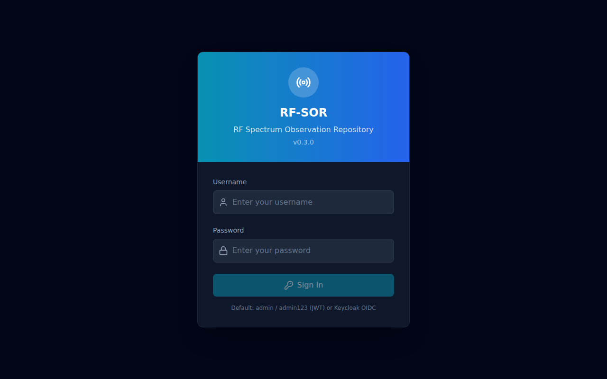

# RF Spectrum Observation Repository (RF-SOR) - User Guide

**Version:** 0.4.1
**Last Updated:** 2026-06-17

---

## Overview

RF-SOR is a web-based Radio Frequency Spectrum Observation Repository that enables operators to:

- Record and manage RF spectrum observations (frequency ranges, bandwidth, modulation types, signal strength)
- Visualize observations geographically on an interactive map
- Import/monitor RF data from various sources
- Synchronize spectrum data across distributed nodes
- Manage user access and authentication (JWT/Keycloak)
- Configure system parameters and operational profiles
- Track ingestion upload history

**Application Stack:**

- Frontend: React 18 + TypeScript + Tailwind CSS + React Router v6 + Leaflet maps
- Backend: Python/FastAPI (port 8000)
- Database: PostgreSQL with PostGIS (port 5432)
- Reverse Proxy: Nginx (port 8082)
- Authentication: JWT + optional Keycloak OIDC

**Access Points:**

- Login: `http://localhost:8082` or `http://localhost:8082/`
- Frontend Dev: `http://localhost:3001`
- Backend API: `http://localhost:8000`

---

## Authentication

### Logging In

1. Navigate to `http://localhost:8082` in your browser
2. Enter your credentials:
   - **Username:** Your assigned username (e.g., `admin`, `operator`, `viewer`)
   - **Password:** Your assigned password
3. Click the **"Sign In"** button
4. Upon successful authentication, you are redirected to the Dashboard

### Role-Based Access

| Role | Dashboard | Observations | Map View | Import | Users | Sync | Settings |
|------|-----------|--------------|----------|--------|-------|------|------|
| VIEWER | Yes | Yes | Yes | No | No | No | No |
| OPERATOR | Yes | Yes | Yes | Yes | No | Yes | No |
| ADMIN | Yes | Yes | Yes | Yes | Yes | Yes | Yes |

The sidebar navigation dynamically shows/hides menu items based on your assigned role.

### Security Notes

- **Minimum password length:** 16 characters (enforced at server)
- **JWT secret key:** Minimum 32 characters (enforced at server)
- **Session timeout:** Tokens expire and require re-authentication
- **Brute-force protection:** Login attempts are rate-limited

---

## Navigation Structure

### Sidebar Navigation

The application uses a vertical sidebar layout on the left side:

- **Brand Area:** RF-SOR logo and version number (v0.4.1)
- **Collapse/Expand Button:** Click the left-facing triangle to collapse the sidebar
- **Navigation Items:** Dynamic based on user role (see role matrix above)
- **User Info:** Current user's username and role shown with avatar
- **Logout Button:** Click to logout and return to the login screen

#### Sidebar Items

| Menu Item | Description |
|------|------|
| Dashboard | Overview statistics and recent activity |
| Observations | Full CRUD management of RF spectrum observations |
| Map View | Interactive Leaflet map with observation markers |
| Import | Import RF data from external formats/sources |
| Ingestion History | Track all data upload operations |
| Users | User management (ADMIN only) |
| Sync | Data synchronization controls (ADMIN/OPERATOR) |
| Settings | System configuration (ADMIN only) |

### Top Bar

The top bar displays:

- **Application Title:** "RF Spectrum Observation Repository"
- **Authentication Status Badge:** Green "Authenticated" or red "Guest"
- **User Email:** Displayed on the right side of the bar

---

## Dashboard

### Overview

The dashboard provides a real-time summary of the RF spectrum system:

| Metric | Description |
|----|------|
| **Total Observations** | Count of all recorded RF observations |
| **Active Users** | Number of currently authenticated users |
| **Regions Count** | Number of defined geographic regions |
| **System Status** | Current health status (Green/Red/Yellow indicators) |

### Recent Activity

Displays recent system activity including:

- New observation records
- User login/logout events
- Import operations
- System health changes

The dashboard auto-refreshes to show the latest status.

---

## Signal Record Management (Observations)

### Overview

This is the primary data management interface for RF spectrum observations. It provides full CRUD operations.

### Observation Fields

Each observation record contains:

- **ID:** Unique identifier (auto-generated UUID)
- **Frequency Start (MHz):** Lower bound of frequency range
- **Frequency End (MHz):** Upper bound of frequency range
- **Bandwidth (MHz):** Signal bandwidth (optional)
- **Modulation Type:** AM, FM, SSB, ASK, FSK, PSK, QAM, OFDM, CW (optional)
- **Signal Strength (dBm):** Received signal power (optional)
- **Classification:** UNCLASSIFIED, CONFIDENTIAL, CLASSIFIED, UNCERTAIN
- **Timestamp:** ISO 8601 datetime of the observation
- **Location (lat, lng):** WKT coordinates (e.g., "51.505, -0.09")
- **Equipment ID:** Source equipment identifier (optional)
- **Technician ID:** User who recorded the observation (optional)
- **Notes:** Free-text field for additional context

### Viewing Observations

1. Click **"Observations"** in the sidebar
2. The main table displays all observations with:
   - **ID column:** Click to view observation details
   - **Frequency Range:** `freq_start` to `freq_end` in MHz
   - **Signal Strength:** Color-coded (green = strong, red = weak)
   - **Classification Status:** Color-coded with label
   - **Timestamp:** Time of observation in ISO format
   - **Actions:** Edit and Delete buttons per row

### Creating New Observations

1. Click the **"+ New Observation"** button (cyan button, top-right)
2. The form opens with pre-filled defaults:
   - **Timestamp:** Auto-populated with current time
   - **Frequency Start:** 0.0 MHz
   - **Frequency End:** 999.0 MHz
   - **Classification:** UNCERTAIN
   - **Location:** Default "0 0"
3. **Required fields:**
   - Frequency Start < Frequency End (validated)
   - Location must be in "lat, lng" format (e.g., "51.505 -0.09")
4. **Optional fields:**
   - Bandwidth (MHz)
   - Modulation Type (dropdown: AM/FM/SSB/ASK/FSK/PSK/QAM/OFDM/CW)
   - Signal Strength (dBm)
   - Location (lat, lng) - stored as WKT format
   - Notes (free text area)
5. Click **"Create"** to save or **"Cancel"** to discard

### Editing Observations

1. Find the observation in the table
2. Click the **edit icon** (pencil) in the Actions column
3. Modify fields as needed
4. Click **"Update"** to save changes

### Deleting Observations

1. Click the **delete icon** (trash can) in the Actions column
2. Confirm the deletion in the browser prompt
3. The observation is logically removed (is_current set to false)

### Filtering and Searching

**Search:** Type in the search bar to filter by frequency, status, or keyword. The search triggers after 400ms debounce.

**Classification Filters:** Click the **"Filters"** button to:
- Toggle between all observations or filtered by classification
- See count per classification level
- Clear filters with one click

---

## Ingestion History

### Overview

Track all data ingestion and upload operations performed on the system. This provides audit trail visibility for data import activities.

### Viewing History

1. Click **"Ingestion History"** in the sidebar
2. View a table of all upload operations including:
   - Upload ID and timestamp
   - File name and format (CSV, JSON, etc.)
   - Number of records processed
   - Status (success/error)

### Filtering

- Filter by date range
- Filter by status (success/error)
- Filter by file format

### Access

- **ADMIN:** Full access to all ingestion records
- **OPERATOR:** View upload history for their own operations
- **VIEWER:** No access to ingestion history

---

## Map View

### Overview

Interactive geographic map using Leaflet.js with OpenStreetMap tiles. Displays RF observation locations, spatial filtering, and region management.

### Map Controls (Top-Right Corner)

Three tabs for filtering modes:

1. **All** - Shows all observations globally
2. **Lat/Lng** - Filter by specific coordinates and radius
3. **Polygon** - Click on map to draw a polygon for spatial filtering

### Map Features

#### Observations Markers

- **Clickable Markers:** Click any marker to fly-map to that observation's location
- **Color-coded Markers:**
  - GREEN: UNCLASSIFIED
  - AMBER: CONFIDENTIAL
  - RED: CLASSIFIED
  - GRAY: UNCERTAIN
- **Click-to-add Coordinates:** Click anywhere on the map to add a new polygon point

#### Spatial Filtering

**Coordinate Filter:**
- Enter latitude and longitude
- Set search radius (10km default)
- Click "Filter" to zoom to the location

**Location Search:**
- Use the locate search bar
- Type observation ID, frequency, or classification
- View results in dropdown
- Click result to zoom to observation on map

**Polygon Filter:**
- Switch to "Polygon" toggle (pencil icon)
- Click on the map to draw polygon points
- Coordinates appear in textarea
- Click "Apply Polygon" to filter observations inside

#### Map Interaction

- **Pan:** Click and drag
- **Zoom:** Mouse wheel or +/- buttons (top-right)
- **Click-to-Add:** In polygon mode, clicking the map adds points
- **Clear Filter:** Click "Clear" to reset spatial filters

---

## Import

### Data Import Interface

Interface for bringing in external RF spectrum data from various sources:

- File uploads (CSV, JSON, custom formats)
- API-based ingestion
- Real-time stream monitoring
- Coordinate system conversion
- Automatic ingestion history tracking

### Import Limits

- **Maximum file size:** Configured system limit
- **Supported formats:** CSV, JSON, custom parsers
- **Rate limiting:** Ingestion attempts are rate-limited to prevent abuse

### Import Process

1. Navigate to **Import** in the sidebar
2. Select file or enter data
3. Preview parsed data (validation preview)
4. Confirm and submit
5. Track status in **Ingestion History**

---

## Users Management

### Overview

Administrative interface for system users. Only accessible to ADMIN role users.

### User Management Features

- **Create New User:** Assign usernames, roles, and temporary passwords
- **Edit User:** Modify roles, permissions, or passwords
- **List Users:** View all system users with their current roles
- **Delete User:** Remove access to the system

### User Roles

- **VIEWER:** Read-only access (Dashboard, Observations, Map View)
- **OPERATOR:** Read/write operations (adds Import and Sync access)
- **ADMIN:** Full administrative access (all modules)

### Security Notes

- Cannot self-assign ADMIN or LEAD roles — must be granted by an existing admin
- All passwords are hashed with bcrypt (with truncation for compatibility)
- Duplicate usernames/emails are prevented

### Role Matrix

| Feature | VIEWER | OPERATOR | ADMIN |
|---------|--------|----------|-------|
| Dashboard | Full stats view | Full stats view | Full stats view |
| Observations | Read + Export | Full CRUD | Full CRUD + Admin tools |
| Map View | View markers | View + Filter | View + Filter + Export |
| Import | — | Full import | Full import |
| Users | — | — | Full management |
| Sync | — | Full sync | Full sync |
| Settings | — | — | Full configuration |

---

## Data Synchronization

### Overview

Controls for synchronizing RF spectrum data between distributed nodes or clusters. Only accessible to OPERATOR and ADMIN roles.

### Sync Operations

- **Push:** Send local observations to remote nodes
- **Pull:** Fetch latest data from remote nodes
- **Merge:** Resolve conflicts between data sources
- **Status:** Monitor sync health and data consistency

---

## System Settings

### Overview

Administrative configuration interface for RF-SOR system settings.

### Configuration Areas

- **Database Settings:** Connection parameters and pool configuration
- **Authentication:** JWT/keycloak OIDC configuration
- **System Parameters:** Operational thresholds, refresh intervals, limits
- **Logging:** Debug and audit level configuration
- **Network:** CORS origins, bind addresses, port configurations
- **Feature Flags:** Toggle optional features

---

## Application Layout

### Sidebar Collapse/Expand

- Click the toggle button (◀/▶) in the top-left corner of the sidebar
- Collapsed mode shows only icons
- Expanded mode shows icons + labels for easier navigation

### User Avatar

- **Color:** Cyan background (rgb(6, 182, 212))
- **Icon:** User silhouette symbol
- **Badge:** Role label displayed below username

### Status Indicators

- **Green:** All systems operational
- **Red:** Error or unhealthy system
- **Yellow:** Warning or degraded performance

---

## Troubleshooting

### Common Issues

1. **Login Failure**
   - Check username/password spelling
   - Verify account is active (ADMIN users page)
   - Check authentication method (JWT vs Keycloak)
   - Clear browser cache if tokens are stale

2. **Map Not Loading Markers**
   - Confirm backend API is running (http://localhost:8000)
   - Check observation records exist in the system
   - Check browser console for JavaScript errors

3. **Import Fails**
   - Verify file format matches backend expectations
   - Check file size against configured limits
   - Ensure backend has write permissions to temp directories
   - Check Ingestion History for error details

4. **Sync Errors**
   - Verify network connectivity to remote nodes
   - Check database health (Postgres 16 with PostGIS 3.4)
   - Monitor sync logs for conflict details

### Support

For technical support